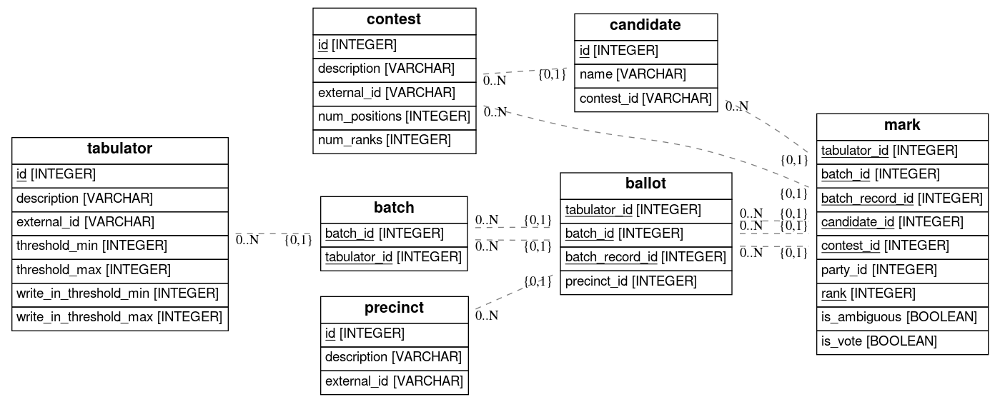

# Introduction

This repository contains code and output data for parsing the RCV data from the 2019 SF elections.

# Usage

* Dependency management is done with [poetry](https://poetry.eustace.io/), read the documentation to get information about how to use it.
* The data processing and loading is done via [Prefect](https://www.prefect.io/). 

# Data Pipeline

# Data Model

The data model is found in the `models.py` file.

Here's an ERD:
